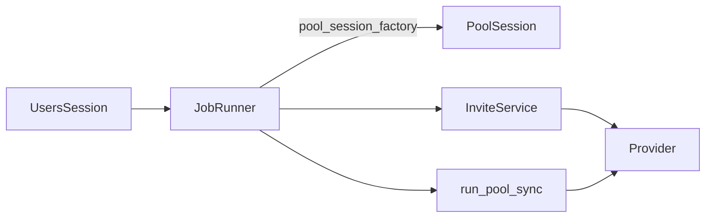

# ChatGPT API 代理请求文档（2025-10-28 更新）

本文档系统梳理 ChatGPT API 代理层的所有请求、容错策略、监控指标与管理后台配套接口，帮助后端与号池组开发在双库架构下快速对齐实现。

---

## 1. 总览

- **作用域**：封装对 `https://chatgpt.com` 后台团队接口的访问，向内部服务（兑换、成员同步、号池组）提供统一 SDK。
- **双库约束**：所有 Provider 调用在 Pool 会话中执行，Users 会话仅保存邀请、兑换与批处理元数据。
- **执行通道**：后台任务统一通过 `JobRunner`（Users Session + Pool Session 工厂）协调，避免随处实例化 `SessionPool()`。

```
调用链：管理/公共接口 → 服务层（Users/Pool） → Provider → ChatGPT 官方 API
监控链：ProviderMetrics → Prometheus Counter/Histogram → /api/admin/metrics
```

---

## 2. Provider 函数映射

> 所有请求默认携带 `Authorization: Bearer {access_token}`，必要时添加 `chatgpt-account-id: {team_id}`。

### 2.1 邀请管理

| 方法 | 函数 | HTTP | 端点 | 说明 |
| --- | --- | --- | --- | --- |
| 发送邀请 | `send_invite(access_token, team_id, email, role="standard-user", resend=True)` | POST | `/backend-api/accounts/{team_id}/invites` | 支持 `resend_emails` |
| 获取邀请列表 | `list_invites(access_token, team_id, offset=0, limit=25, query="")` | GET | 同上 | 支持分页、模糊搜索 |
| 取消邀请 | `cancel_invite(access_token, team_id, invite_id)` | DELETE | `/backend-api/accounts/{team_id}/invites/{invite_id}` | 200/204 视为成功 |

**请求体示例**（发送邀请）：
```json
{
  "email_addresses": ["user@example.com"],
  "role": "standard-user",
  "resend_emails": true
}
```

### 2.2 成员管理

| 方法 | 函数 | HTTP | 端点 |
| --- | --- | --- | --- |
| 获取成员列表 | `list_members(access_token, team_id, offset=0, limit=25, query="")` | GET | `/backend-api/accounts/{team_id}/users` |
| 移除成员 | `delete_member(access_token, team_id, member_id)` | DELETE | `/backend-api/accounts/{team_id}/users/{member_id}` |

返回数据通常包含 `items` 数组，每个成员包含 `email`/`user.email`、`id`、`role` 等字段。Provider 会在邀请同步与号池组同步中遍历这些数据。

### 2.3 团队配置

| 功能 | 函数 | HTTP | 端点 | 备注 |
| --- | --- | --- | --- | --- |
| 更新团队名称 | `update_team_info(access_token, team_id, team_name)` | PATCH | `/backend-api/accounts/{team_id}` | 200/204 视为成功 |
| 启用 Beta | `enable_beta_feature(access_token, team_id, feature)` | POST | `/backend-api/accounts/{team_id}/beta_features` | 200/201 视为成功 |

### 2.4 会话与 Cookie

| 函数 | 说明 |
| --- | --- |
| `fetch_session_via_cookie(cookie_string)` | 发送 `GET https://chatgpt.com/api/auth/session`，提取 `accessToken`、`expires`、`user.email`、`account.id`。 |
| `parse_cookie_string(cookie)` | 将浏览器 Cookie 文本解析为 `dict`，便于注入请求头。 |
| `validate_session_data(data)` | 检查响应是否包含 `accessToken / user / account` 等关键字段。 |

当 `expires` 缺失时，会根据配置 `TOKEN_DEFAULT_TTL_DAYS` 回填本地到期时间。

---

## 3. 容错与熔断

### 3.1 熔断机制

`_with_resilience` 封装所有外部请求：

- **失败阈值**：连续失败 ≥ 3 次触发熔断，60 秒后进入半开状态。
- **重试状态码**：429、500、502、503、504，并使用指数退避（0.5、1、2 秒）。
- **共享熔断键**：按 `(endpoint, team_id)` 维度存储，避免单队列拖垮其他团队。

### 3.2 错误分类与回退

| 场景 | 处理策略 |
| --- | --- |
| 401 / 403 | 标记母号失效（`MotherStatus.invalid`），避免重复调用。 |
| 重试仍失败 | 恢复本地状态（如兑换码从 `blocked` 回滚为 `unused`），返回统一提示。 |
| JSON 解析失败 | 提供原始文本 `{"raw": r.text}`，方便后续诊断。 |

---

## 4. 网络代理与安全

- 代理配置读取自 `HTTP_PROXY` / `HTTPS_PROXY`，通过 `_proxies()` 注入 `requests`。
- 所有请求统一使用桌面浏览器 UA，符合 ChatGPT 官方限制。
- 在会话接口调用时仍带 `origin/referer=https://chatgpt.com`，规避跨站拦截。

### 4.1 管理端安全约定（X-Domain / CSRF）

- 前端所有管理端请求按域添加请求头 `X-Domain: users | pool`；后端在生产环境强制校验：
  - Users 域（如 `/api/admin/users*`、`/codes*`、`/jobs*` 等）要求 `X-Domain: users`。
  - Pool 域（如 `/api/admin/mothers*`、`/pool-groups*` 等）要求 `X-Domain: pool`。
- 非 GET 请求需携带 `X-CSRF-Token`：前端通过 `GET /api/admin/csrf-token` 获取并自动注入；拉取失败时前端直接给出统一报错提示。
- 服务器在响应头回显 `X-Domain-Ack` 便于审计与排查。

---

## 5. 监控指标

`app.metrics_prom` 提供如下 Prometheus 指标：

| 名称 | 标签 | 描述 |
| --- | --- | --- |
| `provider_calls_total` | `endpoint`, `team_id`, `status` | API 调用次数 |
| `provider_latency_ms` | 同上 | 调用耗时（毫秒直方图） |
| `maintenance_lock_acquired_total` / `_miss_total` | — | 维护线程的分布式锁状态 |
| `pool_sync_actions_total` | `action`, `result` | 号池同步操作计数（如 `enqueue` 的 `created/reuse/error`） |
| `child_ops_total` | `action`, `result` | 子号管理操作计数（`list/auto_pull/sync/remove` 的 `ok/error`） |
| `batch_jobs_processed_total` / `_failures_total` / `_processing_ms` | `type`, `status` | `JobRunner` 执行结果与耗时 |
| `admin_api_requests_total` | `path`, `method`, `domain`, `status` | 管理端 API 请求计数（域维度可观测） |

管理后台可通过 `/api/admin/metrics` 拉取，前端在“性能仪表板”显示。

---

## 6. 批处理与 JobRunner

### 6.1 JobRunner 架构



- **Users Session**：读写 `BatchJob`、`InviteRequest` 等数据。
- **Pool Session 工厂**：默认 `SessionPool`；测试环境可传入共享会话，避免内存 SQLite 缺列。
- **职责**：
  - `_process_users_job`：批量重发/取消/移除邀请。
  - `_run_pool_sync_job`：号池母号同步（团队命名、成员回填、补齐席位）。
  - 自动刷新心跳、控制重试次数、写入 `success_count/failed_count`。
  - 去重策略：`pool_sync_mother` 的 `payload` 现包含 `{ mother_id, group_id }`，在入队阶段做应用层去重（若存在相同 `(mother_id, group_id)` 的 `pending/running` 任务则复用）。

### 6.2 管理后台批处理 API

| Endpoint | 方法 | 说明 |
| --- | --- | --- |
| `/api/admin/batch/users/async` | POST | 触发用户批处理任务（现支持 `resend/cancel/remove`），返回 Job ID。 |
| `/api/admin/jobs` | GET | 分页查询任务列表，可按 `status` 过滤。 |
| `/api/admin/jobs/{job_id}` | GET | 任务详情，附带 `payload`。 |
| `/api/admin/jobs/{job_id}/retry` | POST | 重试失败或完成的任务；运行中任务返回 400。 |
| `/api/admin/pool-groups/{group_id}/sync/all` | POST | 将组内所有母号入队 `pool_sync_mother`，入队阶段按 `(mother_id, group_id)` 去重。 |

响应中的 `status` 与 `job_type` 对应 Enum：

- `job_type`: `users_resend`, `users_cancel`, `users_remove`, `pool_sync_mother` 等。
- `status`: `pending`, `running`, `succeeded`, `failed`.

---

## 7. 号池组与双库协同

- Pool 侧：`PoolGroupService`/`admin_jobs` 通过 Pool Session 写入母号、组配置、子号等数据。
- Users 侧：仅保留任务、审计日志，任何 Provider 交互必须经过 Pool 会话。
- 导入流程（Pool 模式）：
  1. `/api/admin/import-cookie` 解析浏览器 Cookie。
  2. 使用 Pool Session 创建/绑定母号。
  3. 通过 `enqueue_pool_group_sync_service(pool_session, users_session)` 录入 `BatchJob`（payload 包含 `mother_id/group_id` 且入队去重）。
  4. 由 `JobRunner` 同步团队命名、成员并补齐 seat。

---

## 8. 开发指南

1. **新增 Provider 方法**：在 `app/provider.py` 增加函数后，务必更新本文件，并补充监控标签。
2. **调用规范**：服务层不得直接使用全局 `SessionPool()`，改由依赖注入工厂。
   - 前端请求请优先使用分域客户端：`usersAdminRequest` / `poolAdminRequest`（分别自动注入 `X-Domain`）。
   - 统一成功交互：使用 `useSuccessFlow`（toast + 可选延时跳转），已在“号池组/生成兑换码”等路径接入。
3. **测试要求**：
   - 涉及外部请求的模块需使用 `unittest.mock.patch` Stub Provider。
   - 新增 Job 类型时，为 `admin_jobs` 与 `JobRunner` 补充单元测试。
4. **文档同步**：若引入新的 ChatGPT 端点、批处理类型、监控指标，请同步本文件并注明日期。

---

## 9. 系统与运行参数

- `GET /api/admin/system`（仅管理员会话）：返回关键只读参数，便于排查与容量规划。

| 字段 | 示例 | 说明 |
| --- | --- | --- |
| `env` | `prod` | 当前运行环境 |
| `jobs.visibility_timeout_seconds` | `300` | Job 可见性租约秒数 |
| `jobs.max_attempts` | `3` | Job 最大重试次数 |
| `rate_limit.enabled` | `true` | 是否启用管理端限流 |
| `ingest_api.enabled` | `false` | 是否启用远程录号 Ingest API |

---

附：常用响应字段说明

| 字段 | 来源 | 说明 |
| --- | --- | --- |
| `invite_request_id` | 兑换接口 | 本地邀请记录 ID（Users 库） |
| `member_id` | Provider 成员列表 | ChatGPT 侧成员标识，用于后续移除/回填 |
| `payload_json` | `BatchJob` | 存储任务参数（如 `mother_id`、`ids`） |
| `visible_until` | `BatchJob` | 租约过期时间，超时后会由调度器重新入队 |

---

若需进一步扩展，可参考 `docs/refactor/phase2_design.md` 中的领域拆分计划，确保代理层演进与双库策略一致。

---

## 10. 子号管理（Pool 域 API）

以下接口已接入并要求 `X-Domain: pool`；非 GET 请求需携带 `X-CSRF-Token`。

| Endpoint | 方法 | 说明 |
| --- | --- | --- |
| `/api/admin/mothers/{mother_id}/children` | GET | 列出指定母号的子号列表（只读）。 |
| `/api/admin/mothers/{mother_id}/children/auto-pull` | POST | 调用 Provider 拉取团队成员，并为母号创建子号记录（去重）。 |
| `/api/admin/mothers/{mother_id}/children/sync` | POST | 同步 Provider 成员信息至子号记录（名称、邮箱、状态）。 |
| `/api/admin/children/{child_id}` | DELETE | 移除一个子号，同时尝试从 Provider 团队移除对应成员。 |

响应示例：

```json
// GET /api/admin/mothers/123/children
{
  "items": [
    {
      "id": 1,
      "child_id": "child-a1b2c3d4e5f6",
      "name": "mother-01-Child-abcd1234-001",
      "email": "mother-01+childabcd1234001@example.com",
      "team_id": "team-01",
      "team_name": "Team 01",
      "status": "active",
      "member_id": "prov_123",
      "created_at": "2025-10-28T12:00:00Z"
    }
  ]
}
```

错误与边界：
- 当母号不存在或 Token 失效时，`auto-pull` 与 `sync` 返回 400 并附带消息。
- `DELETE /children/{child_id}` 在 Provider 移除失败时仍会删除本地记录，并记录告警日志。

---

## 11. 压测与去重验收

为验证 `pool_sync_mother` 入队去重策略，在后端提供压测脚本：

- 脚本路径：`cloud/backend/scripts/pressure_test_pool_enqueue.py`
- 用法：
  - `python cloud/backend/scripts/pressure_test_pool_enqueue.py --attempts 100`
  - 可选参数：`--mother <id> --group <id>`（未提供时会在 Pool 库创建临时母号与号池组）
- 判定：`created_jobs` 应为 `0` 或 `1`。若 `>1`，则视为去重失败。

说明：脚本直接调用 `enqueue_pool_group_sync(pool_session, users_session, mother_id, group_id)` 并行运行，依赖 SQL 级预筛与短时分布式锁去重，观测 Users 库中的 `BatchJob` 记录数是否按预期去重。
